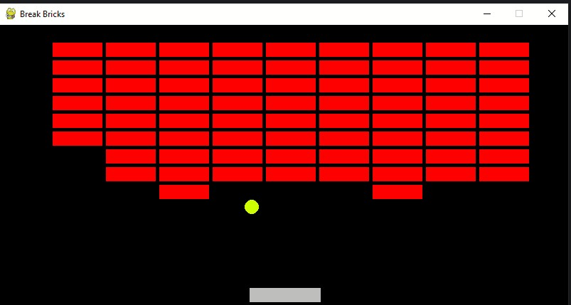
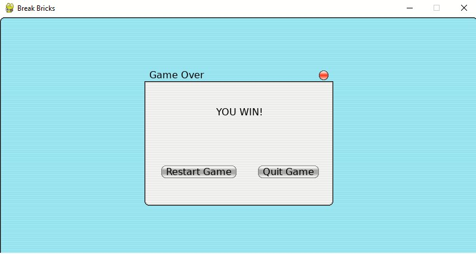

# **BRICK BREAKER**

+ ***How to build***

      def draw_brick(self, screen):
        bricks = []
        for row in range(1, 10):
            for col in range(1, 10):
                x = col * (self.width + 5)
                y = row * (self.height + 5)
                if (x <= screen_x and x >= 0 and y <= screen_y):
                    brick = pygame.Rect(x, y, self.width, self.height)
                    bricks.append(brick)

        for brick in bricks:
            pygame.draw.rect(screen, (184, 134, 11), brick)
        return bricks

+ :hammer_and_wrench:  **create_popup**

  >https://www.geeksforgeeks.org/how-to-create-a-pop-up-in-pygame-with-pgu/

      def check_colision(brick, ball):

        if pygame.Rect.colliderect(brick, ball.ballrect):

            return True

        return False

        if ball.y >= screen_y or len(bricks) == 0:

                create_popup(screen, clock, bricks)

                return

